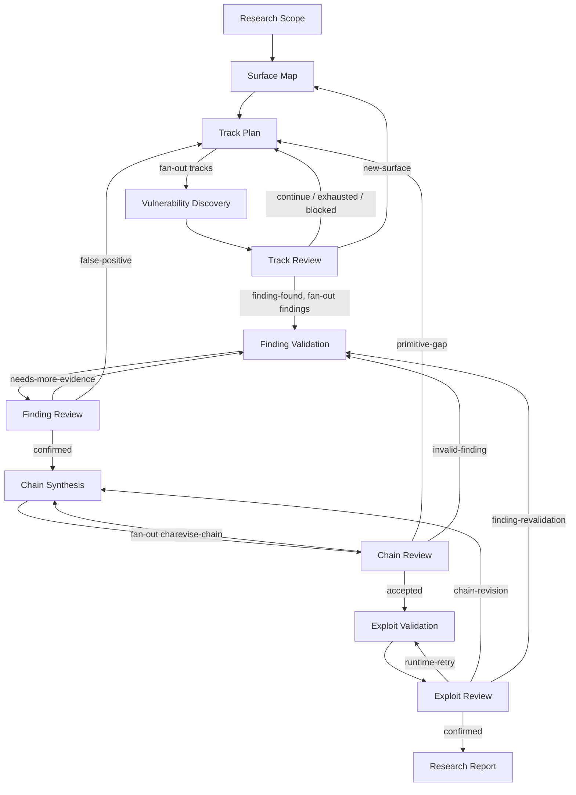

# Current Research Pipeline

本文档描述当前仓库中生效的 Research Pipeline。事实来源是：

- `packages/server/src/services/scan/pipeline/definitions/pipelines/research.yaml`
- `packages/server/src/services/scan/pipeline/definitions/stages/research.yaml`
- `packages/server/src/services/scan/pipeline/definitions/schemas/research.yaml`

## 1. Pipeline Overview

Research Scan 是一个带反馈环的安全研究流水线，不是一次性线性扫描。它围绕四类实体推进：

`Track -> Finding -> Primitive -> Chain -> Exploit Validation -> Report`

其中：

- `Track` 表示一条研究路线或攻击面假设。
- `Finding` 表示有证据支持的潜在漏洞发现。
- `Primitive` 表示经过验证、可被链使用的能力。
- `Chain` 表示由多个能力组成的攻击链。
- `Review` 阶段负责判断下一步路由，不负责生成下游路径字段。
- 下游 review artifact 由 pipeline 从父 task 的完整 `$output` 自动写入 `inputs/*.json`。



## 2. Stage Runtime Modes

当前 stage 配置如下。`serial` 表示该 stage 的全局执行顺序由一个 task 维护；`fanout` 表示上游集合可以拆成多个实体 task。

| Stage | Role | Mode | Configured concurrency | Persistent | Container reuse |
|---|---|---:|---:|---:|---:|
| `research-scope` | scan | serial | 1 | no | yes |
| `surface-map` | scan | serial | 1 | no | yes |
| `track-plan` | scan | serial | 1 | no | yes |
| `vulnerability-discovery` | scan | fanout | 8 | no | yes |
| `track-review` | verification | fanout | 4 | no | yes |
| `finding-validation` | analysis | fanout | 8 | no | yes |
| `finding-review` | verification | fanout | 4 | no | yes |
| `chain-synthesis` | analysis | serial | 1 | no | yes |
| `chain-review` | verification | fanout | 4 | no | yes |
| `exploit-validation` | verification | fanout | 4 | no | yes |
| `exploit-review` | verification | fanout | 4 | no | yes |
| `research-report` | verification | fanout | 2 | no | yes |

所有 stage 的工作目录是 `/workspace/repo`。Research stage 使用 `research-agent`，需要读写 Registry 的 stage 同时使用 `research-db`。

## 3. Common Task Contract

每个 Agent task 最终都要写出结构化 envelope：

```json
{
  "route": "<route-key-or-null>",
  "exit": false,
  "output": {}
}
```

实际 task output 还必须满足该 stage 的 envelope schema。本文下面的 `Output` 只描述 `output` 字段，不重复包裹 `route` 和 `exit`。

通用约束：

- `output.json` 必须由 Agent 写入 task artifact，而不是依赖聊天文本。
- `route` 是 pipeline 路由 envelope 的字段；Review stage 的 `reviewPath` 不由 LLM 生成。
- Review 出边把父 task 的完整 `$output` 写入对应的 `inputs/*-review.json`，再把生成的 `/task/inputs/...` 路径注入下游 input。
- Registry 实体和 revision 由 `research-db` skill 操作；pipeline 负责 task、artifact 和 edge dispatch。

## 4. Stage Details

### 4.1 `research-scope` / Research Scope

**职责**

定义本 Job 的安全研究边界：攻击者起点、信任域、保护资产、部署假设、允许的信息来源、规则和成功标准。该 stage 还会将 scope 持久化为 reserved `__scope__` Track，但不把它作为普通 research track 返回。

**输入**

无必需输入，`ResearchScopeStageInput` 是空对象。

**输出**

```json
{
  "scopePath": "/task/scope.json"
}
```

另外写入 `/task/scope.json`，其大致结构为：

```json
{
  "attackerModel": {},
  "trustedDomain": {},
  "protectedAssets": ["..."],
  "deploymentAssumptions": ["..."],
  "rulesOfEngagement": ["..."],
  "minimumResearchDeadlineAt": "...",
  "successCriteria": {}
}
```

**出边**

| Edge | 条件 | 下游输入 |
|---|---|---|
| `research-scope-to-surface-map` | 无条件 map | `scopePath` |

同时将 `scopePath` 指向的文件复制为下游 `inputs/scope.json`。

### 4.2 `surface-map` / Surface Mapping

**职责**

建立攻击面地图，识别攻击者可到达的 entrypoint、trust boundary、source、sink、组件和依赖数据流，并记录覆盖范围和未决问题。

**输入**

```json
{
  "scopePath": "/task/inputs/scope.json"
}
```

**输出**

```json
{
  "surfaceMapPath": "/task/surface-map.json"
}
```

`surface-map.json` 大致结构：

```json
{
  "entrypoints": [{}],
  "trustBoundaries": [{}],
  "sources": [{}],
  "sinks": [{}],
  "components": [{}],
  "dependencyFlows": [{}],
  "coverage": {},
  "openQuestions": ["..."]
}
```

**出边**

| Edge | 条件 | 下游输入 |
|---|---|---|
| `surface-map-to-track-plan` | 无条件 map | `scopePath`, `surfaceMapPath` |

下游会得到 `inputs/scope.json` 和 `inputs/surface-map.json`。

### 4.3 `track-plan` / Track Planning

**职责**

维护全局 Track portfolio：根据 surface map 和 Registry 状态选择、创建、排序、恢复或耗尽研究路线。它是当前 Track 全局状态调整的唯一串行 stage。

**输入**

初始进入时来自 `surface-map`；反馈进入时来自 `track-review`、`finding-review` 或 `chain-review`。常用输入为：

```json
{
  "scopePath": "/task/inputs/scope.json",
  "surfaceMapPath": "/task/inputs/surface-map.json"
}
```

反馈 task 还会通过 artifact 提供 `track-review.json`、`finding-review.json` 或 `chain-review.json`。

**输出**

```json
{
  "tracks": [
    {
      "trackKey": "...",
      "approachFamily": "...",
      "researchIdea": "...",
      "scope": {},
      "mechanisms": ["..."],
      "coverage": {},
      "evidenceRefs": ["..."],
      "findingIds": ["..."],
      "nextStep": "...",
      "status": "queued"
    }
  ],
  "iteration": 1
}
```

`status` 可为 `queued`、`active`、`blocked` 或 `exhausted`。出边按 `tracks[*]` fan-out，给每个 track 创建 Discovery task。

**出边**

| Edge | 条件 | 模式 | 下游输入 |
|---|---|---|---|
| `track-plan-to-vulnerability-discovery` | 无条件 | fanOut | `scopePath`, `surfaceMapPath`, `track: $item` |

每个 track task 还会得到 scope 和 surface map artifact。

### 4.4 `vulnerability-discovery` / Vulnerability Discovery

**职责**

围绕一个指定 Track 做源代码级漏洞发现：追踪 attacker-controlled data、transformations、guards、sink、可达性、前置条件，并产出 Finding 候选和新 Track 建议。

**输入**

```json
{
  "scopePath": "/task/inputs/scope.json",
  "surfaceMapPath": "/task/inputs/surface-map.json",
  "track": {
    "trackKey": "...",
    "approachFamily": "...",
    "researchIdea": "...",
    "scope": {},
    "mechanisms": []
  }
}
```

**输出**

```json
{
  "trackId": "...",
  "discoveryReportPath": "/task/discovery-report.json"
}
```

`discovery-report.json` 大致结构：

```json
{
  "trackId": "...",
  "source": {},
  "transformations": [{}],
  "guards": [{}],
  "sink": {},
  "reachability": {},
  "attackerControl": {},
  "preconditions": ["..."],
  "findingPaths": [{}],
  "quickDisproofAttempt": {},
  "newTrackSuggestions": [{}]
}
```

`findingPaths` 内的 Finding 结构包含 `findingId`、`trackKey`、title/description、vulnerabilityClass、location、claim、rootCauseKey、source/sink、attackerControl、trustBoundaryCrossings、preconditions、evidence、quickDisproofAttempt 和 confidence。

**出边**

| Edge | 条件 | 下游输入 |
|---|---|---|
| `vulnerability-discovery-to-track-review` | 无条件 map | `scopePath`, `surfaceMapPath`, `track`, `discoveryReportPath` |

下游会读取 `inputs/discovery-report.json`。

### 4.5 `track-review` / Track Review

**职责**

只判断当前 Track 的下一步，不负责修改其他 Track 的全局状态。它审查 Discovery report，判断当前路线应继续、发现 Finding、扩展新 surface、阻塞或耗尽。

**输入**

```json
{
  "scopePath": "/task/inputs/scope.json",
  "surfaceMapPath": "/task/inputs/surface-map.json",
  "track": {},
  "discoveryReportPath": "/task/inputs/discovery-report.json"
}
```

**输出**

```json
{
  "trackKey": "...",
  "decision": "finding-found",
  "summary": "...",
  "findingIds": ["..."],
  "coverageGaps": ["..."],
  "nextStep": "...",
  "blockReason": null,
  "reopenCondition": null
}
```

`decision` 为 `continue`、`finding-found`、`new-surface`、`blocked` 或 `exhausted`。

**出边**

| Edge | Route key | 模式 | 下游 |
|---|---|---|---|
| `track-review-to-track-plan` | `continue`，默认 | map | `track-plan` |
| `track-review-to-surface-map` | `new-surface` | map | `surface-map` |
| `track-review-to-finding-validation` | `finding-found` | fanOut over `findingIds[*]` | `finding-validation` |
| `track-review-exhausted-to-track-plan` | `exhausted` | map | `track-plan` |
| `track-review-blocked-to-track-plan` | `blocked` | map | `track-plan` |

所有出边复制 scope artifact；Review 相关出边还把完整父 output 写成 `inputs/track-review.json`，并通过 `reviewPath` 字段传给下游。

### 4.6 `finding-validation` / Finding Validation

**职责**

验证一个 Finding 是否真实可达、可控且符合部署条件，分析 trust boundary crossing、guards、primitive capability，并执行 quick disproof。

**输入**

```json
{
  "scopePath": "/task/inputs/scope.json",
  "surfaceMapPath": "/task/inputs/surface-map.json",
  "findingId": "...",
  "reviewPath": "/task/inputs/track-review.json"
}
```

在由 Finding Review 或 Chain Review 重返时，输入也可能包含对应 review artifact。

**输出**

```json
{
  "findingId": "...",
  "reachability": {},
  "controllability": {},
  "trustBoundaryCrossings": [{}],
  "guardAnalysis": {},
  "deploymentConditions": ["..."],
  "primitive": {},
  "evidenceRefs": ["..."],
  "disproofResult": {},
  "verdict": "..."
}
```

`primitive` 可以是 `ResearchPrimitive`，也可以是空对象。ResearchPrimitive 大致结构：

```json
{
  "primitiveId": "...",
  "name": "...",
  "capability": "...",
  "requiredInput": {},
  "producedCapability": {},
  "trustLevel": "...",
  "evidenceRefs": ["..."]
}
```

**出边**

| Edge | 条件 | 下游 |
|---|---|---|
| `finding-validation-to-finding-review` | 无条件 | `finding-review` |

完整 validation output 写入 `inputs/finding-validation.json`，并通过 `validationPath` 传递。

### 4.7 `finding-review` / Finding Review

**职责**

独立挑战 Finding Validation，判断是否需要更多证据、是否为误报，或是否确认并进入 Chain Synthesis。

**输入**

```json
{
  "scopePath": "/task/inputs/scope.json",
  "surfaceMapPath": "/task/inputs/surface-map.json",
  "findingId": "...",
  "validationPath": "/task/inputs/finding-validation.json"
}
```

**输出**

```json
{
  "findingId": "...",
  "decision": "confirmed",
  "summary": "...",
  "challenges": [{}],
  "requiredEvidence": ["..."],
  "confirmedPrimitive": {}
}
```

`decision` 为 `confirmed`、`needs-more-evidence` 或 `false-positive`。

**出边**

| Edge | Route key | 下游 |
|---|---|---|
| `finding-review-to-finding-validation` | `needs-more-evidence`，默认 | `finding-validation` |
| `finding-review-to-track-plan` | `false-positive` | `track-plan` |
| `finding-review-to-chain-synthesis` | `confirmed` | `chain-synthesis` |

Review output 会由 pipeline 写入 `inputs/finding-review.json`。

### 4.8 `chain-synthesis` / Chain Synthesis

**职责**

串行读取已确认的 Finding/Primitive，组合成全局 Chain，检查 capability 是否衔接，并记录 primitive gaps。它负责全局 Chain 的创建和调整，因此当前保持 serial。

**输入**

初始或反馈进入时包含 scope、surface map，可能携带 `finding-review.json` 或 `chain-review.json`。典型结构：

```json
{
  "scopePath": "/task/inputs/scope.json",
  "surfaceMapPath": "/task/inputs/surface-map.json",
  "reviewPath": "/task/inputs/finding-review.json"
}
```

**输出**

```json
{
  "chains": [
    {
      "chainId": "...",
      "chainKey": "...",
      "status": "candidate",
      "steps": [{}],
      "entrypoint": {},
      "requiredCapabilities": ["..."],
      "producedCapabilities": ["..."],
      "trustBoundaryCrossings": [{}],
      "deploymentConditions": ["..."],
      "primitiveGaps": [{}],
      "successTarget": {}
    }
  ]
}
```

Chain `status` 可为 `candidate`、`incomplete`、`accepted`、`confirmed`、`primitive-gap` 或 `revise-chain`。每个 Chain step 至少包含 `primitiveId`，通常还关联 `findingId`、entrypoint、capabilities、trust boundary 和 deployment conditions。

**出边**

| Edge | 条件 | 模式 | 下游 |
|---|---|---|---|
| `chain-synthesis-to-chain-review` | 无条件 | fanOut over `chains[*]` | `chain-review` |

### 4.9 `chain-review` / Chain Review

**职责**

审核一条 Chain 的能力衔接、断裂转移、无效 Finding 和缺失 Primitive，决定修订、回到 Track Planning、重新验证 Finding，或接受进入 Exploit Validation。

**输入**

```json
{
  "scopePath": "/task/inputs/scope.json",
  "surfaceMapPath": "/task/inputs/surface-map.json",
  "chain": {}
}
```

**输出**

```json
{
  "chainId": "...",
  "decision": "accepted",
  "brokenTransitions": [{}],
  "invalidatedFindings": ["..."],
  "invalidFindingId": null,
  "requiredRevisions": ["..."]
}
```

`decision` 为 `accepted`、`revise-chain`、`primitive-gap` 或 `invalid-finding`。

**出边**

| Edge | Route key | 下游 |
|---|---|---|
| `chain-review-to-chain-synthesis` | `revise-chain`，默认 | `chain-synthesis` |
| `chain-review-to-track-plan` | `primitive-gap` | `track-plan` |
| `chain-review-to-finding-validation` | `invalid-finding` | `finding-validation`，Finding ID 来自 `$output.invalidFindingId` |
| `chain-review-to-exploit-validation` | `accepted` | `exploit-validation` |

所有出边复制 scope/surface artifact；同时将完整 output 写入 `inputs/chain-review.json`。

### 4.10 `exploit-validation` / Exploit Validation

**职责**

针对已接受 Chain，基于 source-only 规则和 Research Scope 的 success criteria 验证整条链，记录每一步证据、执行上下文、失败点和最终判定。

**输入**

```json
{
  "scopePath": "/task/inputs/scope.json",
  "surfaceMapPath": "/task/inputs/surface-map.json",
  "chain": {},
  "reviewPath": "/task/inputs/chain-review.json"
}
```

**输出**

```json
{
  "chainId": "...",
  "steps": [{}],
  "evidenceRefs": ["..."],
  "executionContext": {},
  "failurePoint": null,
  "successCriteriaResult": "satisfied",
  "verdict": "..."
}
```

`successCriteriaResult` 为 `not_attempted`、`satisfied`、`not_satisfied` 或 `inconclusive`。

**出边**

| Edge | 条件 | 下游 |
|---|---|---|
| `exploit-validation-to-exploit-review` | 无条件 | `exploit-review` |

完整 output 写入 `inputs/exploit-validation.json`，通过 `validationPath` 传入 Exploit Review。

### 4.11 `exploit-review` / Exploit Review

**职责**

独立审查 Exploit Validation，判断链是否可复现、环境假设是否合理、哪些步骤失效，以及是否需要运行时重试、链修订、Finding 重新验证或最终报告。

**输入**

```json
{
  "scopePath": "/task/inputs/scope.json",
  "surfaceMapPath": "/task/inputs/surface-map.json",
  "chain": {},
  "validationPath": "/task/inputs/exploit-validation.json"
}
```

**输出**

```json
{
  "chainId": "...",
  "decision": "confirmed",
  "reproducibility": {},
  "environmentAssumptions": ["..."],
  "invalidatedSteps": [{}],
  "invalidFindingId": null
}
```

`decision` 为 `confirmed`、`runtime-retry`、`chain-revision` 或 `finding-revalidation`。

**出边**

| Edge | Route key | 下游 |
|---|---|---|
| `exploit-review-to-exploit-validation` | `runtime-retry`，默认 | `exploit-validation` |
| `exploit-review-to-chain-synthesis` | `chain-revision` | `chain-synthesis` |
| `exploit-review-to-finding-validation` | `finding-revalidation` | `finding-validation`，Finding ID 来自 `$output.invalidFindingId` |
| `exploit-review-to-research-report` | `confirmed` | `research-report` |

所有出边复制 scope artifact；同时将完整 output 写入 `inputs/exploit-review.json`。

### 4.12 `research-report` / Research Report

**职责**

汇总已确认 Chain，按照 Research Scope 的成功标准生成最终 evidence-backed report。

**输入**

```json
{
  "scopePath": "/task/inputs/scope.json",
  "chain": {},
  "reviewPath": "/task/inputs/exploit-review.json"
}
```

**输出**

```json
{
  "chainId": "...",
  "reportPath": "/task/reports/final-report.md",
  "verdict": "..."
}
```

除结构化 output 外，stage 要求生成 `reports/final-report.md`。

## 5. Edge Artifact Rules

当前 pipeline 的 artifact 传递遵循以下规律：

| 上游结果 | 下游文件 | 下游 input field |
|---|---|---|
| scope output file | `inputs/scope.json` | `scopePath` |
| surface map output file | `inputs/surface-map.json` | `surfaceMapPath` |
| discovery report output file | `inputs/discovery-report.json` | `discoveryReportPath` |
|完整 Track Review output| `inputs/track-review.json` | `reviewPath` |
|完整 Finding Validation output| `inputs/finding-validation.json` | `validationPath` |
|完整 Finding Review output| `inputs/finding-review.json` | `reviewPath` |
|完整 Chain Review output| `inputs/chain-review.json` | `reviewPath` |
|完整 Exploit Validation output| `inputs/exploit-validation.json` | `validationPath` |
|完整 Exploit Review output| `inputs/exploit-review.json` | `reviewPath` |

这里的 `reviewPath`/`validationPath` 是 pipeline 生成的 task-local artifact 路径，不是 Agent 自己创建或决定的文件路径。

## 6. Route Summary

| From | Route key | To | 作用 |
|---|---|---|---|
| Track Review | `continue` | Track Plan | 继续规划当前/其他路线 |
| Track Review | `new-surface` | Surface Map | 扩展攻击面地图 |
| Track Review | `finding-found` | Finding Validation | 验证发现的 Finding |
| Track Review | `exhausted` | Track Plan | 将路线视为耗尽并重新规划 |
| Track Review | `blocked` | Track Plan | 将阻塞反馈交给全局规划器 |
| Finding Review | `needs-more-evidence` | Finding Validation | 补充验证证据 |
| Finding Review | `false-positive` | Track Plan | 放弃误报并重新规划 |
| Finding Review | `confirmed` | Chain Synthesis | 将确认结果纳入 Chain 组合 |
| Chain Review | `revise-chain` | Chain Synthesis | 修订当前 Chain |
| Chain Review | `primitive-gap` | Track Plan | 寻找缺失能力或新路线 |
| Chain Review | `invalid-finding` | Finding Validation | 重新验证无效 Finding |
| Chain Review | `accepted` | Exploit Validation | 验证完整 Chain |
| Exploit Review | `runtime-retry` | Exploit Validation | 重新执行/分析验证 |
| Exploit Review | `chain-revision` | Chain Synthesis | 回到 Chain 设计 |
| Exploit Review | `finding-revalidation` | Finding Validation | 重新验证指定 Finding |
| Exploit Review | `confirmed` | Research Report | 生成最终报告 |

## 7. State Ownership

| 数据 | 主要 owner | 说明 |
|---|---|---|
| Scope | `research-scope` | 生成 scope artifact，并维护 reserved `__scope__` Track |
| Surface Map | `surface-map` | 维护全局攻击面和覆盖问题 |
| Track portfolio | `track-plan` | 串行创建、排序、阻塞、恢复和耗尽 Track |
| 当前 Track 的 discovery | `vulnerability-discovery` | 只围绕被分配的 Track 产出报告/Finding 候选 |
| 当前 Track 的决策 | `track-review` | 只决定当前 Track 的下一步 |
| Finding 验证状态 | `finding-validation` | 产出 reachability、controllability 和 Primitive 证据 |
| Finding 审查结论 | `finding-review` | 决定补证据、误报或确认 |
| Chain portfolio | `chain-synthesis` | 串行组合和调整全局 Chain |
| 当前 Chain 的审查 | `chain-review` | 判断链断点、gap、无效 Finding 或接受 |
| Exploit 验证 | `exploit-validation` | 对接受的 Chain 做 source-only success-criteria 验证 |
| Exploit 审查 | `exploit-review` | 决定重试、修链、重新验证或报告 |
| Final report | `research-report` | 输出最终报告文件和结构化报告结果 |

## 8. Important Semantics

- 所有 `persistent` 当前均为 `false`，因此 rerun 不应沿用旧 Agent session。
- `reuseContainer: true` 只表示容器资源可以复用，不等于 session persistent；runtime 在切换 task 前必须完成旧 driver 的退出和 drain。
- `track-plan`、`surface-map`、`chain-synthesis` 处理全局 Registry 状态，当前保持串行以避免 portfolio 级别的并发写冲突。
- Review stage 可以并发处理不同实体，但每个 task 的输入应限定到自己的 Track、Finding 或 Chain。
- 路由由 output envelope 的 `route` 决定；route 在 task completion 时和 output 一起持久化，dispatch 重试使用原始 route。
- 如果路由边带有 `$output.invalidFindingId` 等表达式，必须先通过 output schema 校验，再创建下游 task。
- 空的 `findingIds`、`chains` 或无匹配 route 不会凭空创建下游实体；它们需要由相应 stage 的 Registry 写入和结构化 output 支持。
