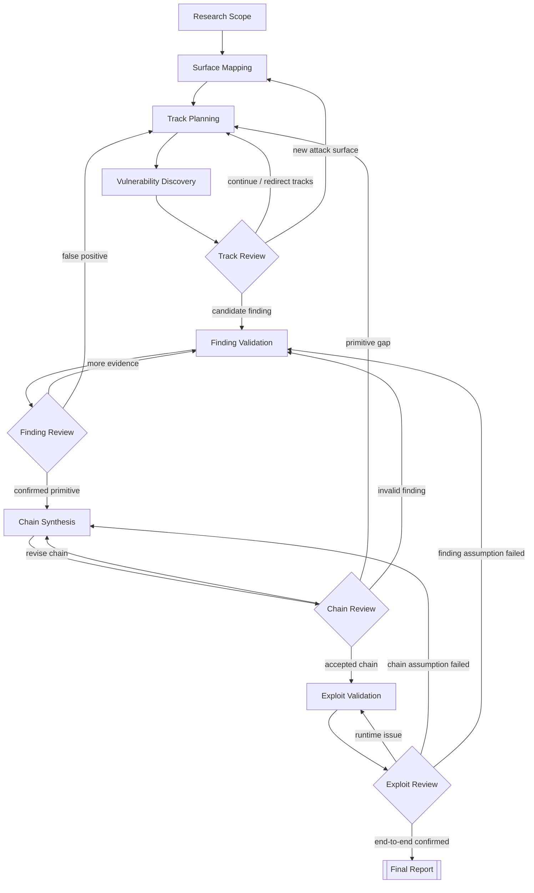

# Security Vulnerability Research Workflow

This document defines a distributed, multi-stage vulnerability-research pipeline for an arbitrary target project. It is a research design only. Nothing in this document authorizes scanning, exploit execution, agent startup, dependency cloning, or access to protected data.

## Objective

Starting from the attacker model supplied with the scan job, identify and independently validate security-relevant findings and, when required by the configured success criteria, a complete exploit chain that reaches the target impact.

The workflow must be based on first-principles source analysis. It must not use changelogs, Git history, patched-version diffs, or Internet research unless explicitly allowed by the scan job. The `third_party/` directory may be inspected or populated only when a dependency is part of a demonstrated data flow.

## Research Task Inputs

The scan job supplies the target project source, attacker starting point, deployment assumptions, protected assets, permitted information sources, and success criteria. Examples include an unauthenticated or authenticated starting point, a required trust-boundary crossing, a data-access impact, or server-side code execution.

The workflow must treat these values as data, not hard-coded assumptions. A stage must not claim a stronger impact than the configured success criteria or the source evidence supports.

Use multiagents agressively. You may spawn up to 4 agents at any one time. Do not use a fixed assignment such as "N agents for strategy X." Instead, manage the search using the following heuristics:

- Begin with a genuinely diverse portfolio of approaches. Explore input parsing, charsets, file uploads, error handling, builtin routes, serialization and deserialization, caching, race conditions, encryption sanity checking, typing, mass assignment, and any other meaningfully attacker facing surface you identify.
- Maintain an explicit registry of approach families. Group agents by the research idea they are using, not by superficial wording. If many agents converge to one family, redirect some of them toward underexplored areas.
- Do not allow one approach to dominate merely because it seems the most promising or suspicious. When an approach stalls, mark that route as blocked. Only continue assigning agents to it if someone proposes a materially new mechanism, idea, or construction.
- Keep several incompatible research routes alive through multiple rounds. Cross-pollinate ideas only after independent agents have developed them far enough to expose their real strengths and gaps.
- Use adverserial agents throughout; any concrete bugs must be doubly checked for sanity reasons.
- The pipeline should repeatedly synthesize, challenge, redirect, and launch new rounds. Do not stop after the first wave fails. Produce a complete chain only when it survives the configured review gates.

The target project may depend on libraries and other software. A `third_party/` folder may be provided for dependency source that must be audited because it is part of the demonstrated attacker-controlled data flow. Any impact may require chaining findings across these dependencies.

Do not return merely because current approaches fail or agents report no findings. Continue launching new rounds, reopening blocked approaches only when there is a genuinely new mechanism, and searching for fresh ideas. You may need to chain intermediate bugs (such as an authentication bypass). Spend at least 3 hours on this before giving up.

## Topology

The pipeline has no central Root Orchestrator. Vulseek executes the stages and routes their structured outputs. Each adaptive decision point owns a local feedback loop.



The pipeline runtime is the scheduler. Research state is carried by database records and task artifacts. There is no global component that receives and interprets every stage response.

## Shared Contracts

Every stage receives a stage-specific JSON input and returns a schema-valid JSON output. Large evidence is written to task artifacts; outputs contain paths and references rather than copying entire reports.

The Agent output contract must follow the existing full-scan protocol. `output.json` has exactly this envelope:

```json
{
  "route": null,
  "exit": false,
  "output": {}
}
```

The envelope fields are not business output fields:

- `route` is a string only for stages with declared routed edges; otherwise it is `null`.
- `exit` is `false` unless the stage explicitly supports an agent-exit workflow.
- `output` contains only the stage-specific schema-defined object.
- No additional top-level fields are allowed.

`researchId`, `scanJobId`, `taskId`, `stage`, `iteration`, `status`, and runtime metadata come from task input, pipeline context, or the database. They must not be repeated in every stage output. `evidenceRefs` is included only in stages whose schema needs evidence references. `nextRoute` is not an output field; the envelope `route` selects the next edge.

Each research stage schema must follow the full-scan conventions for artifact paths: large objects are written to task files, output contains path manifests or compact summaries, and downstream YAML edges copy those artifacts into `inputs/`. The TypeScript runtime validates the envelope first and then validates `output` against the selected stage or route schema.

`Research Track Registry` is persistent state, not a controller. It records `id`, `approachFamily`, `researchIdea`, `scope`, `mechanisms`, `status`, `coverage`, `evidenceRefs`, `candidateFindingIds`, `blockReason`, `reopenCondition`, `nextStep`, `iteration`, and the current task assignment.

The registry uses current-state projections plus mandatory append-only events. The projection answers "what is true now"; events answer "how did it get here". Events are required for track redirection, primitive confirmation, chain revision, review decisions, and recovery. They are not a copy of agent transcripts or full task outputs.

### Registry Tables

The implementation adds six tables:

1. `research_tracks`: the current state of each approach family and research route.
2. `research_track_events`: append-only creation, activation, blocking, reopening, review, and routing decisions for tracks.
3. `exploit_primitives`: confirmed capabilities produced by reviewed findings, including required input, produced capability, trust level, and evidence references.
4. `exploit_primitive_events`: append-only confirmation, invalidation, and evidence-change events for primitives.
5. `exploit_chains`: the current projection of each chain candidate, including ordered primitive references, deployment conditions, gaps, status, and revision.
6. `exploit_chain_events`: append-only chain construction, step changes, gap discovery, review decisions, invalidation, and acceptance events.

Finding state does not require a new registry table in the first version. Existing `vulnerability_candidates` records provide finding identity and evidence, while `candidate_result_projections` provide the latest Analysis, Verification, and Triage results. Registry events reference candidate IDs and task IDs instead of duplicating their outputs.

Each event contains `eventId`, `researchId`, `entityType`, `entityId`, `eventType`, `actorTaskId`, `sourceStage`, `expectedRevision`, `resultingRevision`, a short structured `payload`, `evidenceRefs`, and `createdAt`. Large reports remain task artifacts. A state transition and its event must be written in one database transaction; events are never updated or deleted.

Consumers read the current projection for scheduling and routing, and use the event ledger for audit, debugging, recovery, review context, and reconstructing why a route or chain changed. Event writes must be idempotent using the source task, entity, event type, and expected revision, so retries cannot create duplicate transitions.

Allowed track states are:

```text
queued -> active -> candidate-found -> under-validation -> confirmed
active -> blocked
active -> exhausted
under-validation -> invalidated
blocked -> active      # only with a materially new mechanism or construction
```

`Exploit Primitive` is a confirmed capability such as authentication bypass, arbitrary file read/write, SSRF, unsafe deserialization, or command execution. `Primitive Gap` is a missing capability between two otherwise validated chain steps; it must become a new targeted Research Track and may not be silently assumed.

## Stage Specifications

### 0. Research Scope

Purpose: define the engagement boundary and the attacker model before code exploration.

Input:

- The research task statement.
- Target project source in the repository.
- The available `third_party/` directory.
- The stated typical production deployment assumptions.

Work:

- Define the initial principal as a remote unauthenticated attacker.
- Assume no account, session, API token, trusted network position, local filesystem access, or direct database access.
- Define untrusted inputs: network requests, protocol fields, uploads, serialized data, cache values, and attacker-influenced records.
- Define the trusted target domain: target project server processes, database, workers, queues, caches, runtime dependencies, and process-visible filesystem.
- Define success using the scan job's configured impact and protected assets; do not infer a stronger impact or privilege requirement.
- Record prohibited information sources and the dependency-audit carveout.

Output: `research-scope.json` containing `attackerModel`, `trustedDomain`, `protectedAssets`, `deploymentAssumptions`, `rulesOfEngagement`, and `successCriteria`.

Constraints:

- Do not identify a vulnerability yet.
- Do not assume authentication bypass, database access, or root privileges.
- Do not treat a theoretical local-only issue as a pre-auth finding.

Route: always proceeds to `Surface Mapping`.

### 1. Surface Mapping

Purpose: enumerate the attacker-facing attack surface and trust boundaries from source code.

Input: `research-scope.json`, application routes, middleware, protocol handlers, configuration, database boundaries, background-job entrypoints, and dependency declarations.

Work:

- Enumerate public HTTP, WebSocket, Git, import/export, upload, callback, and builtin routes.
- Mark authentication and authorization checks, parser boundaries, normalization steps, persistence boundaries, worker handoffs, and filesystem operations.
- Identify candidate sources and sinks without claiming exploitability.
- Record components and dependencies that process attacker-controlled data.
- Keep a coverage inventory of inspected files, routes, sinks, and excluded areas.

Output: `attack-surface-inventory.json` containing `entrypoints`, `trustBoundaries`, `sources`, `sinks`, `components`, `dependencyFlows`, `coverage`, and `openQuestions`.

Constraints:

- Enumeration must be source-backed.
- Do not use patched code or historical comparisons.
- A dependency enters scope only when the target project passes relevant attacker-controlled data into it.

Routes: proceed to `Track Planning`; if a new major surface appears later, `Track Review` may return here.

### 2. Track Planning

Purpose: create and select independent Research Tracks for the next discovery round.

Input: `research-scope.json`, `attack-surface-inventory.json`, `Research Track Registry`, prior `Track Review` decisions, and any `Primitive Gap` records.

Work:

- Seed genuinely different approach families such as input parsing, charset handling, file/archive processing, serialization, deserialization, builtin routes, error handling, caching, race conditions, encryption validation, typing, mass assignment, and dependency-specific behavior.
- Add a new track when a materially distinct attacker-facing surface or mechanism is discovered.
- Select tracks using coverage gaps and evidence quality, not agent preference.
- Assign a bounded target, expected evidence, and next step to each selected track.

Output: `track-assignments.json` plus an updated `research-track-registry.json` with `queued` or `active` tracks.

Constraints:

- Do not preassign agents permanently to a route family.
- Do not merge independent routes merely because they touch the same controller.
- Do not allow one family to dominate while incompatible families remain unexplored.
- A blocked route may reopen only with a new mechanism, idea, or construction.

Routes: assignments go to `Vulnerability Discovery`; newly discovered high-level surfaces go to `Surface Mapping`.

### 3. Vulnerability Discovery

Purpose: perform independent source-to-sink vulnerability research for one assigned Research Track.

Input: one `track-assignment`, the relevant surface inventory, source code, local configuration, and permitted dependency source.

Work:

- Trace attacker-controlled data from a pre-auth entrypoint through parsing, validation, transformation, persistence, queueing, and dispatch.
- Identify missing or inconsistent checks, type confusion, unsafe interpretation, privilege changes, race windows, and dangerous sinks.
- Distinguish a code smell from an attacker-reachable vulnerability.
- Record quick disproof attempts and all assumptions needed for exploitability.
- Propose a new Research Track if a materially different mechanism is found.

Output: `discovery-report.json` containing `trackId`, `source`, `transformations`, `guards`, `sink`, `reachability`, `attackerControl`, `preconditions`, `candidateFindings`, `quickDisproofAttempt`, and `newTrackSuggestions`.

Constraints:

- One task must stay within its assigned track and target scope.
- Do not declare the configured impact from a primitive that has not been validated.
- Do not use a prior agent's conclusion as evidence without checking the cited code.
- Findings must include precise file, symbol, and line evidence.

Routes: reports go to `Track Review`; no direct route to chain synthesis.

### 4. Track Review

Purpose: locally triage discovery results and control the Research Track loop.

Input: discovery reports for the current iteration, the track registry, coverage inventory, and candidate findings.

Work:

- Deduplicate findings that use the same mechanism and evidence.
- Mark tracks `active`, `blocked`, `exhausted`, or `candidate-found`.
- Reject unsupported claims without hiding the underlying route report.
- Detect coverage gaps and create new Research Tracks.
- Select candidates with enough source evidence for validation.
- Keep several incompatible tracks alive across rounds.

Output: `track-review.json` containing `continueTracks`, `newTracks`, `blockedTracks`, `exhaustedTracks`, `candidateFindingIds`, `coverageGaps`, and `nextRoute`.

Constraints:

- Track Review does not confirm a vulnerability.
- It must not close a route only because the first agent found nothing.
- A new route must state why it is materially distinct from existing families.
- The maximum number of concurrent subagents is 4.

Routes:

- `continue` or `new-track` -> `Track Planning`.
- `new-surface` -> `Surface Mapping`.
- `candidate-found` -> `Finding Validation`.

### 5. Finding Validation

Purpose: determine whether one vulnerability candidate is real and characterize the exploit primitive it provides.

Input: one `Vulnerability Candidate`, its discovery report, cited source files, relevant configuration, and dependency evidence.

Work:

- Verify that a remote unauthenticated attacker can reach the entrypoint.
- Verify attacker control over the relevant input and every transformation before the sink.
- Check all authentication, authorization, validation, normalization, typing, and error paths.
- Establish production deployment preconditions and whether they match the stated model.
- Attempt a concrete quick disproof.
- Describe the resulting `Exploit Primitive` only at the capability level supported by evidence.

Output: `finding-validation.json` with `candidateId`, `reachability`, `controllability`, `trustBoundaryCrossings`, `guardAnalysis`, `deploymentConditions`, `primitive`, `evidenceRefs`, `disproofResult`, and `verdict`.

Constraints:

- `likely-valid` is not the same as `confirmed`; it must pass `Finding Review`.
- Do not infer code execution from file write, SSRF, SQL injection, or deserialization alone.
- Do not silently rely on credentials, local access, or a non-typical deployment.

Route: always goes to `Finding Review`.

### 6. Finding Review

Purpose: independently challenge the validation result and act as the local quality gate.

Input: `finding-validation.json`, original discovery evidence, and the relevant source paths.

Work:

- Recheck the source-to-sink path independently.
- Search for omitted guards, signature checks, type constraints, unreachable branches, and incorrect deployment assumptions.
- Verify that the claimed primitive follows from the evidence and is not overstated.
- Request a narrowly defined validation task when evidence is incomplete.

Output: `finding-review.json` containing `candidateId`, `decision`, `challenges`, `requiredEvidence`, `confirmedPrimitive`, and `nextRoute`.

Allowed decisions:

```text
confirmed
needs-more-evidence
false-positive
```

Constraints:

- Use an independent task and session from the validating agent.
- Review is adversarial but must cite concrete code evidence.
- It does not broaden into unrelated vulnerability discovery.

Routes:

- `confirmed` -> `Chain Synthesis`.
- `needs-more-evidence` -> `Finding Validation`.
- `false-positive` -> `Track Planning`.

### 7. Chain Synthesis

Purpose: combine confirmed exploit primitives into candidate exploit chains.

Input: confirmed findings, primitive inventory, application/dependency topology, deployment assumptions, and prior chain candidates.

Work:

- Model each primitive by required input, produced capability, trust level, and reachable next boundary.
- Construct chains from the configured attacker starting point through intermediate capabilities to the configured impact.
- Verify that adjacent steps share a real data flow or reachable state transition.
- Identify `Primitive Gaps` instead of assuming an unproven bridge.
- Keep alternative chains independent until their assumptions are validated.

Output: `exploit-chain-candidate.json` containing ordered `steps`, `entrypoint`, `requiredCapabilities`, `producedCapabilities`, `trustBoundaryCrossings`, `deploymentConditions`, `primitiveGaps`, and `successTarget`.

Constraints:

- Every chain step must reference a confirmed finding or a clearly marked unverified dependency.
- A chain is not complete merely because it contains a high-impact primitive.
- A `Primitive Gap` must become a new targeted track; it cannot be filled by narrative assumption.
- The chain must satisfy the configured attacker model and success criteria.

Routes:

- `primitive-gap` -> `Track Planning`.
- `invalid-finding` discovered during construction -> `Finding Validation`.
- candidate chain -> `Chain Review`.

### 8. Chain Review

Purpose: independently audit whether the candidate exploit chain is technically continuous.

Input: `exploit-chain-candidate.json`, all referenced findings, primitive-gap records, and deployment assumptions.

Work:

- Check each step's reachability and output-to-input compatibility.
- Verify that authentication, network, worker, database, filesystem, and dependency boundaries are crossed as claimed.
- Attempt to break the chain at every transition.
- Confirm that the final execution context satisfies the configured success criteria.

Output: `chain-review.json` containing `decision`, `brokenTransitions`, `invalidatedFindings`, `requiredRevisions`, and `nextRoute`.

Allowed decisions:

```text
accepted
revise-chain
primitive-gap
invalid-finding
```

Constraints:

- Review must be performed by an independent agent/session.
- “Probably exploitable” is not an accepted decision.
- Any broken transition must reference the exact missing condition or code evidence.

Routes:

- `accepted` -> `Exploit Validation`.
- `revise-chain` -> `Chain Synthesis`.
- `primitive-gap` -> `Track Planning`.
- `invalid-finding` -> `Finding Validation`.

### 9. Exploit Validation

Purpose: validate the accepted chain end to end against the authorized target environment or a controlled equivalent.

Input: accepted chain, exact reproduction prerequisites, runtime configuration, and expected intermediate effects.

Work:

- Validate each chain transition in order.
- Record actual inputs, outputs, trust-boundary crossings, execution context, and failure point.
- Confirm the final impact and its ability to satisfy the configured success criteria.
- Keep runtime evidence separate from source-analysis evidence.

Output: `exploit-validation.json` containing `chainId`, `steps`, `evidenceRefs`, `executionContext`, `failurePoint`, `successCriteriaResult`, and `verdict`.

Constraints:

- This stage is not authorized by this plan; it remains a defined stage only.
- Use only the explicitly authorized target environment.
- Do not touch release services, unrelated repositories, or unrelated filesystems.
- Do not claim success from a partial chain or a simulated step.

Route: always goes to `Exploit Review`.

### 10. Exploit Review

Purpose: independently review end-to-end runtime evidence and distinguish a real exploit from an environment-specific artifact.

Input: `exploit-validation.json`, accepted chain, source evidence, and deployment model.

Work:

- Check that the runtime execution matches the source-derived chain.
- Verify that no hidden credentials, pre-seeded state, manual database changes, or privileged operator action enabled success.
- Check reproducibility and whether the deployment assumptions are typical and documented.
- Identify whether failure is in runtime setup, chain construction, or finding validity.

Output: `exploit-review.json` containing `decision`, `reproducibility`, `environmentAssumptions`, `invalidatedSteps`, and `nextRoute`.

Allowed decisions:

```text
confirmed
runtime-retry
chain-revision
finding-revalidation
```

Routes:

- `confirmed` -> `Final Report`.
- `runtime-retry` -> `Exploit Validation`.
- `chain-revision` -> `Chain Synthesis`.
- `finding-revalidation` -> `Finding Validation`.

### 11. Final Report

Purpose: produce the final evidence-backed result after independent source and exploitability review.

Input: confirmed exploit chain, finding reviews, chain review, exploit validation, exploit review, and limitations.

Output: `final-exploit-chain.json` and `final-report.md` containing:

- pre-auth entrypoint;
- source-to-sink path for every step;
- trust-boundary crossings;
- confirmed exploit primitives;
- exact chain prerequisites;
- runtime evidence;
- success-criteria result;
- false positives and rejected routes;
- deployment limitations and confidence level.

Constraints:

- Only an `Exploit Review` decision of `confirmed` can reach this stage.
- Do not include unsupported claims or silently omit broken routes.
- A report without a chain satisfying the configured attacker model and success criteria is incomplete.

## Agent and Scheduling Model

There is no permanent agent-to-stage assignment and no central Orchestrator. Vulseek's normal task scheduler supplies at most four concurrent workers. A stage may fan out one worker per Research Track, candidate, or review task and uses explicit route keys to continue its local loop.

Recommended model strength:

- Strong models: `Vulnerability Discovery`, `Finding Validation`, `Finding Review`, `Chain Synthesis`, `Chain Review`, `Exploit Review`.
- Medium models: `Research Scope`, `Surface Mapping`, `Track Planning`, `Track Review`.
- Fast models: schema validation, duplicate detection, artifact indexing, and report formatting.

The worker task must return structured evidence. The next stage decides whether that evidence is sufficient; no worker may promote its own finding directly to a confirmed exploit chain.

## Global Constraints

- Use first-principles source analysis.
- Do not use changelogs, Git history, patched-version diffs, or Internet research.
- The `third_party/` carveout applies only to dependencies demonstrated to be in the attacker-controlled data flow.
- Begin with a diverse portfolio of approach families.
- Keep incompatible Research Tracks alive across multiple rounds.
- Register materially distinct new attack surfaces or mechanisms as new tracks.
- Mark stalled routes blocked or exhausted; reopen only with a materially new mechanism or construction.
- Any concrete vulnerability must receive independent adversarial review.
- Do not stop after the first failed round or because a single route produced no findings.
- Maintain the research process for at least three hours before concluding failure, unless an explicit external stop is issued.
- Do not execute this plan, start agents, clone dependencies, run exploits, alter databases, or access protected assets without explicit authorization.

## Code Implementation Plan

This section supplements the research workflow above with the implementation plan for a new scan mode. The new mode is named `research`, is parallel to `full` and `delta`, and must not silently fall back to either existing mode.

### Pipeline and Agent Runtime

Add a `research` pipeline with these stage IDs:

```text
research-scope
surface-map
track-plan
vulnerability-discovery
track-review
finding-validation
finding-review
chain-synthesis
chain-review
exploit-validation
exploit-review
research-report
```

Each stage uses the existing Generic Agent Stage and task lifecycle:

- `persistent: false`, `reuseContainer: true`, and a new session per task.
- Agents read source code, task artifacts, and the read-only research broker.
- Agents return the existing full-scan envelope `{ route, exit, output }`; TypeScript validates and persists the stage-specific `output`.
- The existing scheduler enforces a maximum of four concurrent workers.
- Stage loops are expressed as YAML route edges; no central Orchestrator is introduced.

Do not add a research-wide output envelope containing `researchId`, `iteration`, `stage`, `status`, `evidenceRefs`, or `nextRoute`. Context fields are supplied through task input and `StageContext`; task status is persisted by the pipeline runtime; evidence references are declared only by the stage schemas that need them; and routing uses the envelope `route` field.

Add external YAML definitions, stage prompts, JSON schemas, and skills for all twelve stages. The resource loader continues to use `VULSEEK_SCAN_PIPELINE_DEFINITIONS_PATH`; definitions must be loaded at pipeline start and must not be embedded in the application build artifact.

The research route graph is:

```text
research-scope -> surface-map -> track-plan -> vulnerability-discovery -> track-review
track-review -> track-plan | surface-map | finding-validation
finding-validation -> finding-review
finding-review -> finding-validation | track-plan | chain-synthesis
chain-synthesis -> chain-review
chain-review -> chain-synthesis | track-plan | finding-validation | exploit-validation
exploit-validation -> exploit-review
exploit-review -> exploit-validation | chain-synthesis | finding-validation | research-report
```

`Exploit Validation` is source-only in v1. It must not execute payloads or access protected assets; its output records static chain validation and uses `successCriteriaResult: "not_attempted"`.

### Scan Type and Runtime Integration

Extend the scan type contract to `"delta" | "full" | "research"` and update the PostgreSQL enum, Drizzle schema, API input, queue types, runtime settings, stage metadata, stage graph, UI labels, and scan creation dialogs.

Introduce one `getPipelineIdForScanType()` mapping and use it everywhere instead of ternaries that default unknown values to `full`. Update job creation, root task naming, pipeline construction, queue recovery, pause/resume, cancel, settlement, retry, rerun, and stage graph APIs.

Add `runResearchScan()` and route `runScanJobInContainer()` by the persisted scan type. Repository preparation follows full-scan semantics: use target ref/tag/commit and do not use a delta base diff. Existing full and delta behavior remains unchanged, including automatic delta polling.

Expose Research Scan through both API and UI. The creation dialog accepts ref/tag, hides the delta commit window, shows research stage settings, and uses the existing Job Overview, Tasks, Session, and stage graph pages.

Research Scope writes a three-hour minimum research deadline to its artifact by default. The value is configurable on the server, but the pipeline must not terminate early merely because the current round found no candidate.

### Registry and Persistence

The previous five-table proposal is expanded to six tables so each mutable registry entity has an explicit event ledger:

1. `research_tracks`
2. `research_track_events`
3. `exploit_primitives`
4. `exploit_primitive_events`
5. `exploit_chains`
6. `exploit_chain_events`

Use `scanJobId` as `researchId`; do not add a separate research-run table in v1. Current-state tables store the latest projection. Event tables are append-only and store the entity ID, event type, source task/stage, expected and resulting revision, compact JSON payload, evidence references, idempotency key, and timestamp.

Every projection update and event insert must run in one transaction. State transitions use optimistic `revision` checks. Retries use a deterministic idempotency key derived from source task, entity, event type, and expected revision. Full prompts, transcripts, and large reports remain task artifacts and are not copied into registry rows.

Reuse `vulnerability_candidates` for finding identity and `candidate_result_projections` for existing candidate-stage results. Do not add a separate finding registry in v1. A primitive may only be created after Finding Review confirms the corresponding finding.

Extend declarative stage effects with a `research-registry` effect. Its TypeScript dispatcher performs track assignment/review persistence, primitive creation, chain revision, and event writes after validated task completion. Agents never write Registry tables directly.

### Read-Only Research Broker

Add a server-side broker with a fixed internal service identity. The broker exposes only allow-listed read operations:

```text
list-tracks, get-track, list-track-events,
list-findings, list-primitives,
list-chains, get-chain, list-chain-events
```

Each request includes `scanJobId`, `taskId`, and the operation. The server verifies that the task belongs to the scan job and rejects cross-job access, writes, arbitrary SQL, and unsupported operations. Missing broker configuration is an explicit research-task error; there is no direct database or artifact fallback.

Add a `research-db` Python helper inside the corresponding skill. It calls the broker, validates the response, and prints bounded JSON for the agent. The runtime skill installer copies it into the task container together with the stage skill. TypeScript remains the only write path.

### Tests and Verification

Add tests for:

- research scan type schema, API/UI creation, root task, labels, and pipeline selection;
- research YAML, stage schemas, prompt/skill presence, route cycles, fan-out, and artifact mapping;
- start, pause, resume, recovery, cancel, retry, and rerun without falling back to full or delta;
- Registry transactions, revision conflicts, event idempotency, and duplicate completion;
- broker authorization, cross-job isolation, read-only enforcement, and Python helper errors;
- track review loops, finding validation/review, primitive gaps, chain revision, and final report routing;
- source-only exploit validation with `successCriteriaResult: "not_attempted"`;
- regression coverage for existing full and delta scans.

Run only against local dev:

```bash
pnpm --filter @vulseek/server typecheck
pnpm --filter vulseek typecheck
pnpm --filter vulseek test
git diff --check
```

Create and apply the migration only to the dev database. Do not connect to, migrate, restart, or modify release.
